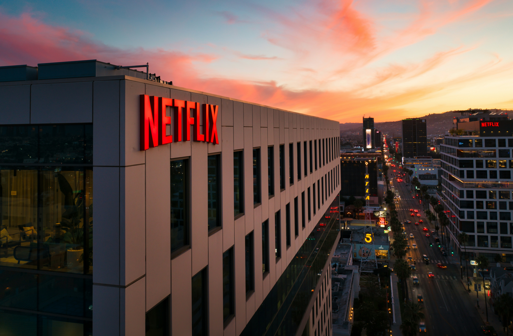
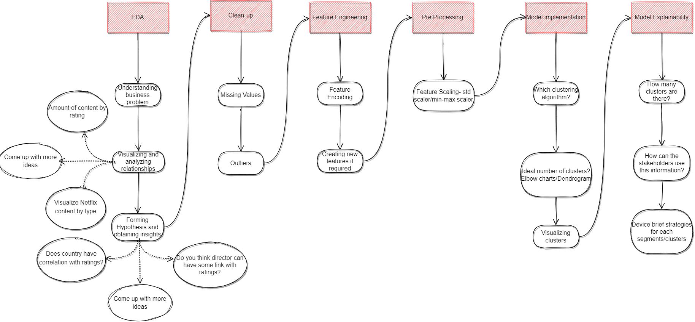

**NETFLIX MOVIES AND TV SHOWS CLUSTERING**

**Objectives:**

Exploratory Data Analysis
Understanding what type content is available in different countries
If Netflix has been increasingly focusing on TV rather than movies in recent years.
Clustering similar content by matching text-based features

**Methods used:**

Descriptive Statistics
Data Visualization
Machine Learning

**Libraries utilized:**

Pandas for data manipulation, aggregation

Matplotlib and Seaborn for visualization and behavior with respect to the target variable

NumPy for computationally efficient operations

**Dataset used:**

This dataset consists of tv shows and movies available on Netflix as of 2019. The dataset is collected from Flixable which is a third-party Netflix search engine.

**Project Architecture:**
